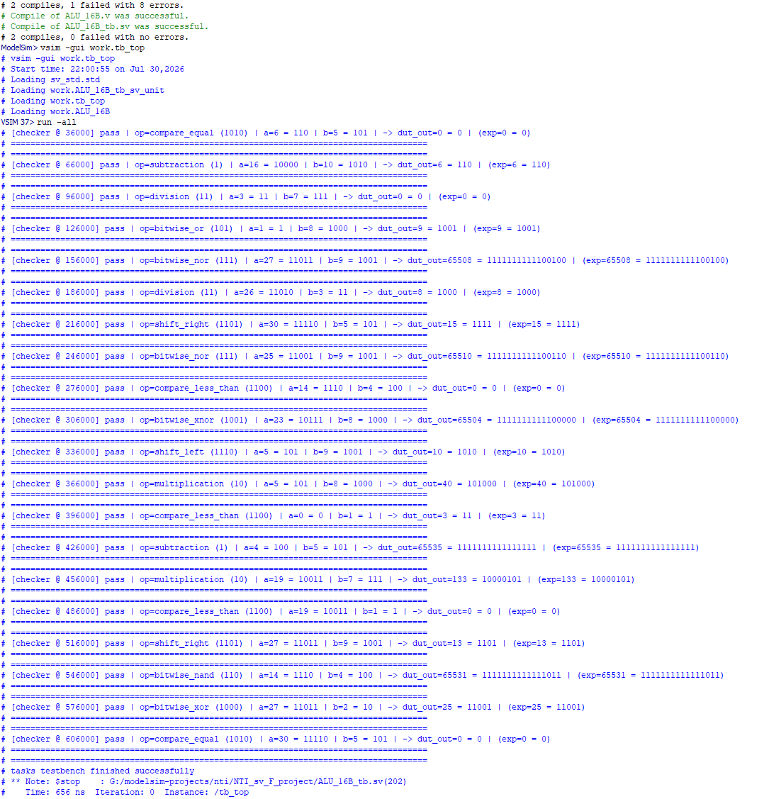
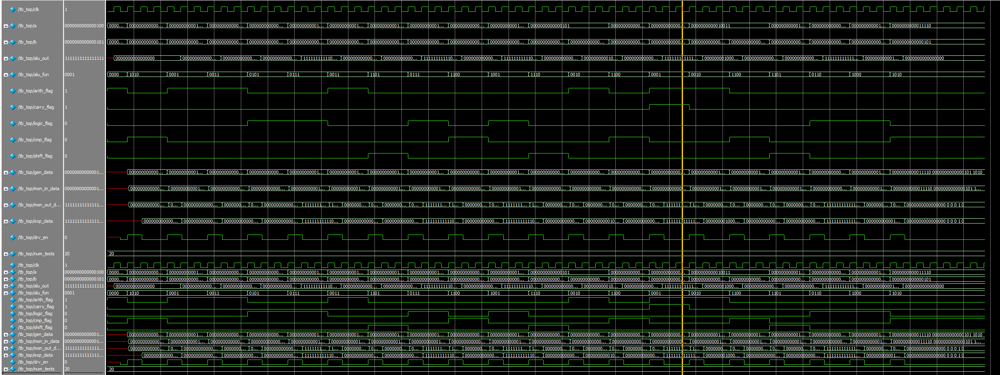

# ALU 16-bit Testbench (NTI Project)

## Overview

This project is part of the **NTI Digital IC Design Training**.

The objective of this assignment is to **verify an existing 16-bit ALU design** by developing a self-checking SystemVerilog Testbench.

> **Note:** The ALU RTL design was provided by instructor.  
> Only the verification environment (Testbench) was implemented.

---

## Project Structure

```
.
ALU-16B-Testbench/
│
├── ALU_16B.v          # Provided RTL Design
├── ALU_16B_tb.sv      # SystemVerilog Testbench
├── README.md
└── result.png         # Simulation Result
```

---

## Verification Environment

The testbench follows a simplified verification flow inspired by common verification methodologies.

```
                Generator
                    │
                    ▼
                 Driver
                    │
                    ▼
                   DUT
                    │
                    ▼
                 Monitor
                    │
             ├──────────────┐
            ▼              ▼
         Predictor      DUT Output
            │              │
             └──────┬─────┘
                    ▼
                  Checker
```

---

## Testbench Components

### Generator
- Generates randomized input transactions.
- Produces:
  - Operand A
  - Operand B
  - ALU operation

---

### Driver
Applies generated inputs to the DUT.

---

### Input Monitor
Captures:
- A
- B
- ALU Function

---

### Output Monitor
Captures:
- ALU Output
- Carry Flag
- Arithmetic Flag
- Logic Flag
- Compare Flag
- Shift Flag

---

### Predictor (Reference Model)

Calculates the expected output using SystemVerilog behavioral code.

Supported operations:

| Opcode | Operation |
|---------|-----------|
|0000|Addition|
|0001|Subtraction|
|0010|Multiplication|
|0011|Division|
|0100|AND|
|0101|OR|
|0110|NAND|
|0111|NOR|
|1000|XOR|
|1001|XNOR|
|1010|Compare Equal|
|1011|Compare Greater|
|1100|Compare Less|
|1101|Shift Right|
|1110|Shift Left|

---

### Checker

Compares:

- DUT Output
- Expected Output

and prints either:

```
PASS
```

or

```
FAIL
```

for every test case.

---

## Test Strategy

- Randomized stimulus
- Self-checking verification
- Automatic result comparison
- Functional verification of arithmetic, logic, compare, and shift operations

Current configuration:

- Number of random tests: **20**

---

## Sample Simulation Output

```
[checker @ 36000] pass | op=compare_equal
[checker @ 66000] pass | op=subtraction
[checker @ 96000] pass | op=division
...
tasks testbench finished successfully
```

All executed test cases completed successfully.

---

## Simulation

Compile the design and testbench:

```tcl
vlog ALU_16B.v
vlog ALU_16B_tb.sv
```

Start simulation:

```tcl
vsim work.tb_top
```

Run simulation:

```tcl
run -all
```
---
## Simulation Result

The following screenshot shows the successful execution of the self-checking testbench.




---

## Features

- Self-checking Testbench
- Random stimulus generation
- Reference model (Predictor)
- Automatic checking
- Monitor-based architecture
- Clear PASS/FAIL reporting

---

## Tools

- SystemVerilog
- ModelSim / QuestaSim

---

## Author

**Ahmed Mohamed Attia**

Faculty of Engineering  
Electronics and Communications Engineering

NTI Digital IC Design Training
