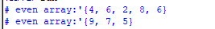
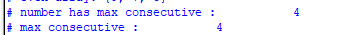
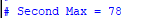
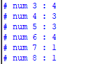

# Lab 6 – SystemVerilog Arrays

## Overview

This lab contains several SystemVerilog programming exercises demonstrating the use of dynamic arrays, queues, associative arrays, and array methods.

---
## Task 1 – Separate Even and Odd Numbers

### Input

```text
'{4, 9, 6, 7, 2, 5, 8, 6}
```

### Objective

Separate the array into:

- Even numbers
- Odd numbers

### Output



---

## Task 2 – Longest Consecutive Sequence

### Input

```text
'{1, 2, 3, 4, 4, 4, 4, 5, 6}
```

### Objective

Find the value with the longest consecutive repetition.

### Output



---

## Task 3 – Second Maximum Number

### Input

```text
'{12, 45, 78, 21, 56, 34}
```

### Objective

Find the second largest number in the array.

### Output



---

## Task 4 – Frequency Counter

### Input

```text
'{3,3,3,3,4,4,4,5,5,5,6,6,6,6,7,8}
```

### Objective

Count the frequency of each element using an associative array.

### Output


---

## SystemVerilog Concepts Used

- Dynamic Arrays
- Queues
- Associative Arrays
- foreach Loop
- Array Methods (`max()`)
- push_back()
- $display()

---

## Simulation Tool

- ModelSim / QuestaSim

---

## Author

Ahmed Mohamed Attia

NTI Digital IC Design Training
